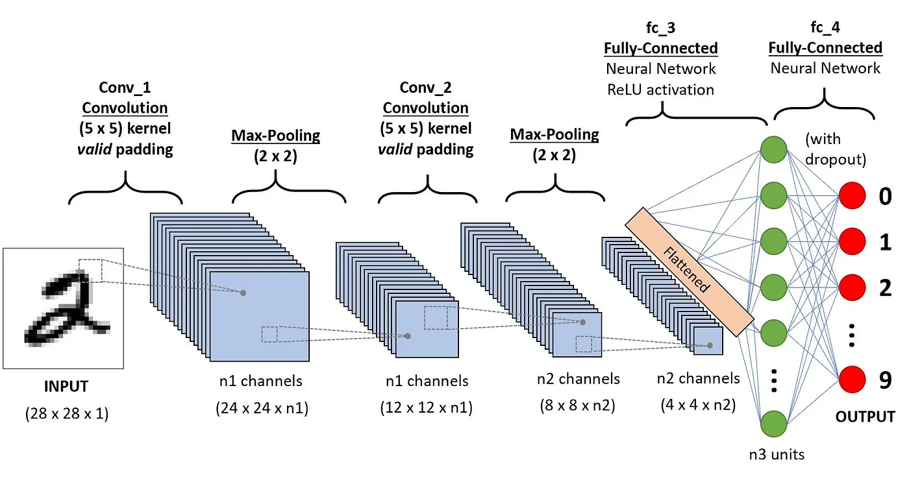

# Arsitektur CNN

- Convolution 1 = Layer 1
  - Max Polling 2x2 = digunakan untuk memecah pixel menjadi lebih kecil dengan ukuran 2x2 pixel sehingga akan menurunkan resolusi gambar
- Convolution 2 = Layer 2
  - Max Polling 2x2 = digunakan untuk memecah pixel menjadi lebih kecil dengan ukuran 2x2 pixel sehingga akan menurunkan resolusi gambar
- Fully Connected Flattened ini adalah teknik regulasi untuk mengurangi overfitting dengan mengatur beberapa neuron secara acak selama pelatihan. Dalam hal ini, 50% neuron akan di-drop selama pelatihan.
- Output dengan melakukan aktifasi fungsi softmax layer fully connected dengan 10 neuron, sesuai dengan jumlah kelas yang ingin diprediksi (misalnya, CIFAR-10 memiliki 10 kelas). Fungsi aktivasi Softmax digunakan untuk menghasilkan probabilitas untuk setiap kelas.

